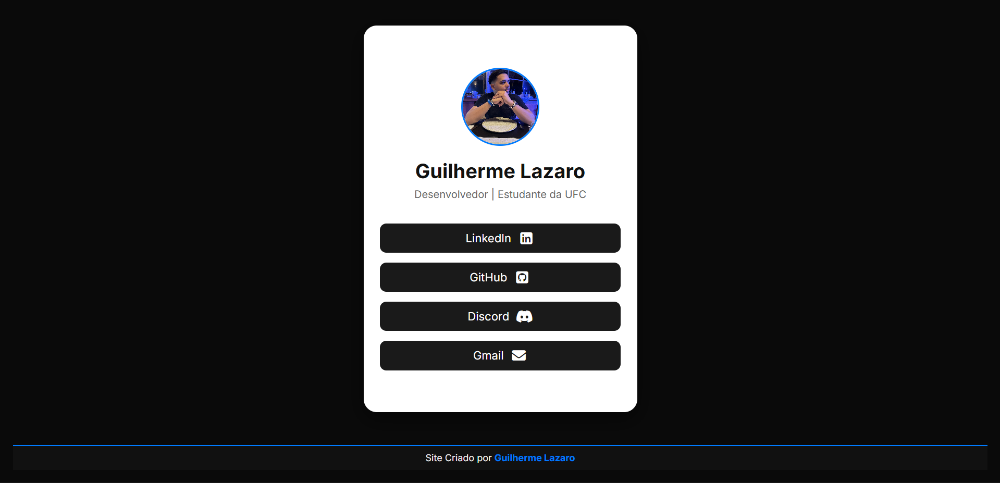

<h1 align="center">🌐 Meus Links</h1>

<p align="center">
  
</p>

<p align="center">
  <b>Um site simples e elegante para reunir todos os meus links em um só lugar.</b>
</p>

<p align="center">
  <a href="https://guilhermelazaro10.github.io/meus-links/">
    
  </a>
</p>

---

## ✨ Sobre o projeto

O **Meus Links** é um projeto pessoal desenvolvido com **HTML** e **CSS puro**.  
Ele funciona como uma página de perfil profissional, similar ao Linktree, hospedada gratuitamente pelo **GitHub Pages**.  
O design foi pensado para ser **minimalista**, **responsivo** e com **modo escuro**.

---

## 🧠 Funcionalidades

✅ Links rápidos para minhas principais redes (LinkedIn, GitHub, Discord e Gmail)  
✅ Layout responsivo e moderno  
✅ Hospedagem gratuita via GitHub Pages  
✅ Código aberto sob a licença MIT  

---

## 🛠️ Tecnologias utilizadas

| Tecnologia     | Descrição                           |
|----------------|-------------------------------------|
| 🧱 **HTML5**   | Estruturação do conteúdo             |
| 🎨 **CSS3**    | Estilização e layout responsivo      |
| 🚀 **GitHub Pages** | Hospedagem gratuita e automática  |

---

## 🧩 Estrutura de pastas
```
meus-links/
│
├── imagens/ # Fotos
│ ├── preview.png
│ └── IMG_5046.jpeg
│
├── index.html # Página principal (arquivo HTML)
├── style.css # Arquivo de estilos (CSS)
├── README.md # Documentação (README)
└── LICENSE # Licença do projeto (MIT)

```

---

## 🧍‍♂️ Autor

**Guilherme Lazaro**  
🎓 Desenvolvedor | Estudante da UFC  

<p align="left">
  <a href="https://www.linkedin.com/in/guilherme-lazaro-943a76346/" target="_blank">
    
  </a>
  <a href="https://github.com/Guilhermelazaro10" target="_blank">
    
  </a>
  <a href="mailto:guilhermelazaro@gmail.com" target="_blank">
    
  </a>
</p>

---

## 🪪 Licença

Este projeto está licenciado sob a **Licença MIT** — você pode usá-lo, modificar e redistribuir livremente, desde que mantenha os créditos.

---

<p align="center">
  Feito com ❤️ por <a href="https://github.com/Guilhermelazaro10">Guilherme Lazaro</a>
</p>

